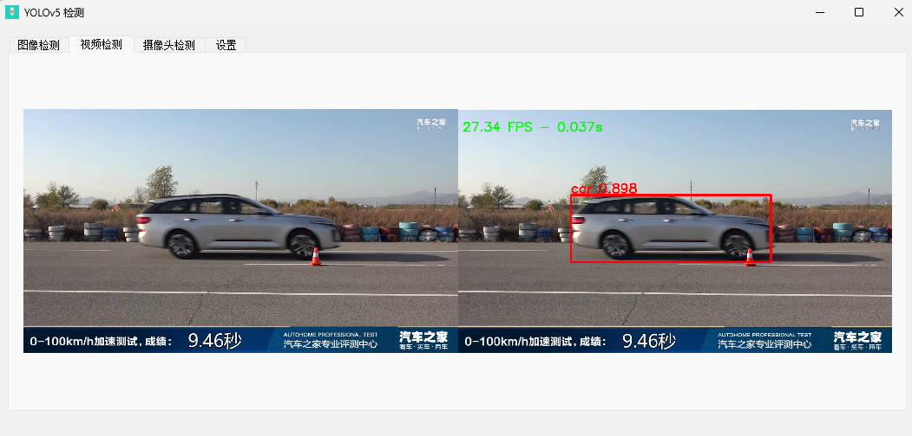
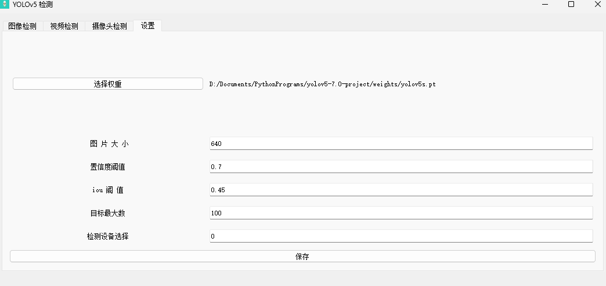
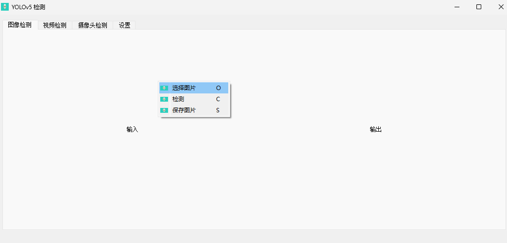
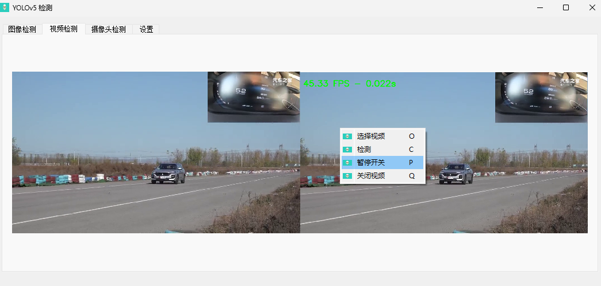
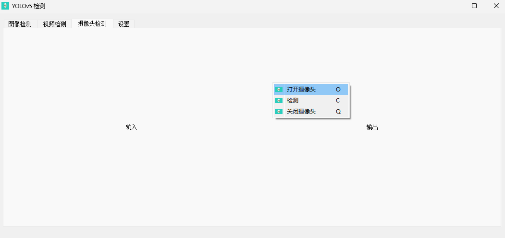

# yolov5-detect-Tool

# Overview

这是使用yolov5算法识别图像的项目，对算法检测接口进行了封装，可直接调用函数，传入图像即可实现图像检测。

你需要一个自己使用yolo算法训练好的权重文件(.pt文件)，需要使用时，将此文件路径传入接口初始化函数中，例如，如下所示，你需要将路径赋值给weight变量，其他参数默认即可，可根据需求更改。

**如何使用：**

```python
from DetectApi import DETECT_API        #yolov5使用模型检测接口

# 初始化接口
with open("configure.txt", "r") as f:
    conf_data=f.read().split(" ")
    print(conf_data)
weight = conf_data[0]            # 权重文件路径
imgsz = int(conf_data[1])        # 输入图片的大小 默认640(pixels)
conf_thres = float(conf_data[2]) # object置信度阈值 默认0.25  用在nms中
iou_thres = float(conf_data[3])  # 做nms的iou阈值 默认0.45   用在nms中
max_det = int(conf_data[4])      # 每张图片最多的目标数量  用在nms中
device = conf_data[5]            # 'gpu' or 'cpu'
DETECT = DETECT_API(weight, imgsz, conf_thres, iou_thres, max_det, device)

# 获取图片
img = ...

# 检测图片
detections = DETECT.detect(img)

# 查看结果
print(detections )
```

# 关于环境

直接把虚拟环境里的库都导入到requirements.txt和freeze.yml文件中了。

可以在自己创建的虚拟环境中下载这些库。
如果还没有conda环境，建议新建一个

```python
conda env create -f freeze.yml
```

如果已有自己的conda环境，可以直接安装需要的依赖环境。

```python
conda install --yes --file requirements.txt 
```

# 关于可视化测试工具

## 基于pyqt5

使用了pyqt写了一个可视化测试工具。虚拟环境的终端中运行如下代码：

```python
python detect_UI.py
```





工具配置参数在文件configure.txt中，可修改。

```python
weights/yolov5s.pt 640 0.7 0.45 100 0
```

也可在工具中修改，设置界面




图片检测界面



视频检测界面



摄像头检测界面（默认使用编号0的摄像头，可在代码中修改）

```python
class Begin:
    ...
    # 第237行代码
    def open_cam(self):
        self.cap = cv2.VideoCapture(0)    # 0:摄像头编号
        if self.cap.isOpened():
            self.cam_switch=1
        else:
            self.cam_switch=0
            return 0
```



设置界面


***<u>容易发现，除了鼠标右击弹出菜单选项进行操作外，还可以使用快捷键进行操作。</u>***

快捷键如下：

O:    打开（图片|视频|摄像头）

C： 检测

Q： 关闭（视频|摄像头）

P： 暂停视频

## 基于tkinter

tkinter库是python自带的GUI库，不需要再安装

功能与基于pyqt5可视化工具一致。

但仍有些需要注意的地方。

```python
# 运行
python detect_tkUi.py
```

开始时，显示界面是一片空白，需要鼠标点击一下界面。然后根据快捷键选择检测界面（注意不要使用鼠标点击上面的tab按键切换界面）。

使用此可视化工具时，几乎全程使用快捷键操作。

快捷键：

1： 图像检测界面

2： 视频检测界面

3： 摄像头界面

4： 设置界面

O:    打开（图片|视频|摄像头）

C： 检测

Q： 关闭（视频|摄像头）

P： 暂停视频

# 最后

虽然使用的是yolov5算法，但是其他版本的yolo训练好的权重文件，在此工具中大概率也能使用。

### 能干什么

主要还是封装一个接口，方便调用图像检测。

基本的，传入图像，进行检测。

可以将视频一帧一帧的作为图像传入接口，实现视频检测。

可以将摄像头视频流循环读取帧，将图像帧传入接口，实现实时的视频检测。

无线传输图像，进行检测，然后将检测结果回传给客户端。

等等。


**有许多不足之处，望包涵，可批评指正。**
